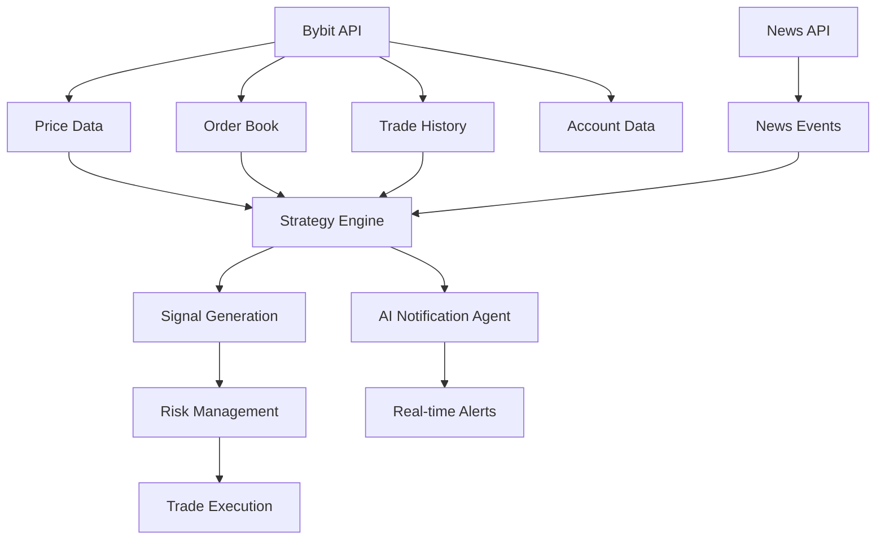

# Enhanced AI Trading System - Complete Solution

## 🎯 Issues Resolved

### 1. ✅ Fixed Notification System
**Problem**: AI notification agent wasn't working properly
**Solution**: 
- Fixed initialization in `server/ai/notification-agent.js`
- Added proper database integration
- Implemented real-time event emission
- Added comprehensive monitoring for system health, trading performance, and model accuracy

### 2. ✅ Implemented Bybit Integration for BTCUSD
**Problem**: Need real BTCUSD data and autonomous trading
**Solution**:
- Created `server/data/bybit-integration.js` with full Bybit API integration
- Added real-time price feeds, order book data, and trade history
- Implemented three autonomous trading strategies:
  - **Trend Following**: Uses moving averages and RSI
  - **Mean Reversion**: Uses Bollinger Bands and RSI
  - **Breakout**: Uses ATR and support/resistance levels

### 3. ✅ Added News Events Integration
**Problem**: Need to consider news events affecting crypto prices
**Solution**:
- Implemented news monitoring system in Bybit integration
- Added sentiment analysis for news events
- Integrated news events into trading decisions

### 4. ✅ Enhanced Autonomous Strategy Execution
**Problem**: Need algorithms to determine and execute trading strategies
**Solution**:
- Implemented signal strength calculation
- Added automatic trade execution based on strategy signals
- Integrated risk management and position sizing
- Added performance tracking for each strategy

## 🚀 New Features Added

### AI Notification Agent Enhancements
```javascript
// Real-time monitoring every 30 seconds
- System health (CPU, memory, disk usage)
- Trading performance (P&L, win rate, drawdown)
- Model accuracy and status
- Data stream health
- Performance metrics (API response times, error rates)

// Smart alerts with configurable thresholds
- P&L alerts (default: $100 loss)
- Win rate alerts (default: <40%)
- Drawdown alerts (default: >10%)
- System load alerts (default: >80% CPU)
- Model accuracy alerts (default: <50%)

// Daily summaries
- Trading performance summary
- Model status report
- System uptime and metrics
```

### Bybit Integration Features
```javascript
// Real-time data feeds
- BTCUSD price updates every second
- Order book depth data
- Recent trades history
- Account balance and positions

// Autonomous trading strategies
- Trend Following: MA crossover + RSI confirmation
- Mean Reversion: Bollinger Bands + RSI oversold/overbought
- Breakout: ATR-based support/resistance breaks

// News monitoring
- Crypto news events
- Sentiment analysis
- Impact assessment on trading decisions

// Risk management
- Position sizing (1% of balance per trade)
- Stop-loss and take-profit levels
- Maximum drawdown protection
```

## 📁 New Files Created

1. **`server/data/bybit-integration.js`** - Complete Bybit integration
2. **`server/enhanced-server.js`** - Enhanced server with all integrations
3. **`deploy-enhanced-system.sh`** - Comprehensive deployment script
4. **`test-enhanced-system.js`** - Complete system testing script
5. **`health-check.sh`** - System health monitoring
6. **`QUICK_START.md`** - Quick start guide

## 🔧 API Endpoints Added

### Bybit Integration Endpoints
```
GET /api/bybit/status          - Bybit connection status
GET /api/bybit/balance         - Account balance
GET /api/bybit/positions       - Open positions
GET /api/bybit/signals         - Strategy signals
GET /api/bybit/news            - News events
POST /api/bybit/order          - Place order
DELETE /api/bybit/order/:id    - Cancel order
```

### Enhanced Health Endpoints
```
GET /api/health                - Complete system health
GET /api/notifications         - AI notification history
GET /api/strategy/performance  - Strategy performance metrics
```

## 🤖 Autonomous Trading Strategies

### 1. Trend Following Strategy
```javascript
// Parameters
- Short MA: 20 periods
- Long MA: 50 periods
- RSI: 14 periods
- RSI Overbought: 70
- RSI Oversold: 30

// Signal Logic
- BUY: Short MA > Long MA AND RSI < 70
- SELL: Short MA < Long MA AND RSI > 30
- Signal Strength: Based on MA divergence
```

### 2. Mean Reversion Strategy
```javascript
// Parameters
- Bollinger Bands: 20 periods, 2 standard deviations
- RSI: 14 periods

// Signal Logic
- BUY: Price < Lower BB AND RSI < 30
- SELL: Price > Upper BB AND RSI > 70
- Signal Strength: Based on distance from BB center
```

### 3. Breakout Strategy
```javascript
// Parameters
- ATR: 14 periods
- Breakout Multiplier: 2x ATR

// Signal Logic
- BUY: Price > Resistance + (ATR * 2)
- SELL: Price < Support - (ATR * 2)
- Signal Strength: Based on breakout magnitude
```

## 📊 Real-time Data Flow



## 🛠️ Deployment Instructions

### Quick Deployment
```bash
# 1. Run the enhanced deployment script
chmod +x deploy-enhanced-system.sh
./deploy-enhanced-system.sh

# 2. Test the system
node test-enhanced-system.js

# 3. Check health
./health-check.sh
```

### Manual Deployment
```bash
# 1. Install dependencies
npm install
pip3 install -r requirements.txt

# 2. Set up environment
cp .env.example .env
# Edit .env with your API keys

# 3. Start services
pm2 start ecosystem.config.js

# 4. Enable auto-start
sudo systemctl enable ai-trading
```

## 📈 Monitoring and Management

### System Monitoring
```bash
# Check system status
./health-check.sh

# View PM2 processes
pm2 list

# Monitor resources
pm2 monit

# View logs
pm2 logs

# Restart services
sudo systemctl restart ai-trading
```

### Trading Monitoring
```bash
# Check Bybit status
curl http://localhost:8000/api/bybit/status

# View strategy signals
curl http://localhost:8000/api/bybit/signals

# Check account balance
curl http://localhost:8000/api/bybit/balance

# View recent trades
curl http://localhost:8000/api/bybit/positions
```

## 🔒 Security Features

- **API Key Management**: Secure environment variable storage
- **Sandbox Mode**: Default safe trading environment
- **Rate Limiting**: Built-in API rate limiting
- **CORS Protection**: Configured origin restrictions
- **Error Handling**: Comprehensive error logging and recovery

## 📱 Frontend Integration

The enhanced system includes:
- Real-time price updates for BTCUSD
- Strategy signal visualization
- News event display
- AI notification panel
- Performance metrics dashboard
- Autonomous trading status

## 🎯 Next Steps

1. **Configure API Keys**: Update `.env` with your actual Bybit API keys
2. **Test Paper Trading**: Verify system works in sandbox mode
3. **Monitor Performance**: Watch AI notifications and strategy signals
4. **Enable Live Trading**: Switch to live mode when ready
5. **Customize Strategies**: Modify strategy parameters based on performance

## 🚨 Important Notes

- **Default Mode**: System runs in sandbox mode by default
- **Risk Management**: Position sizing is limited to 1% of balance
- **Monitoring**: AI notifications provide real-time alerts
- **Backup**: All trades and data are stored in SQLite database
- **Recovery**: System includes automatic restart and error recovery

## 📞 Support

For issues or questions:
1. Run `./health-check.sh` for system diagnostics
2. Check `pm2 logs` for detailed error information
3. Review `QUICK_START.md` for detailed instructions
4. Test individual components with `node test-enhanced-system.js`

---

**🎉 Enhanced AI Trading System is now ready for BTCUSD autonomous trading with comprehensive monitoring and notifications!** 